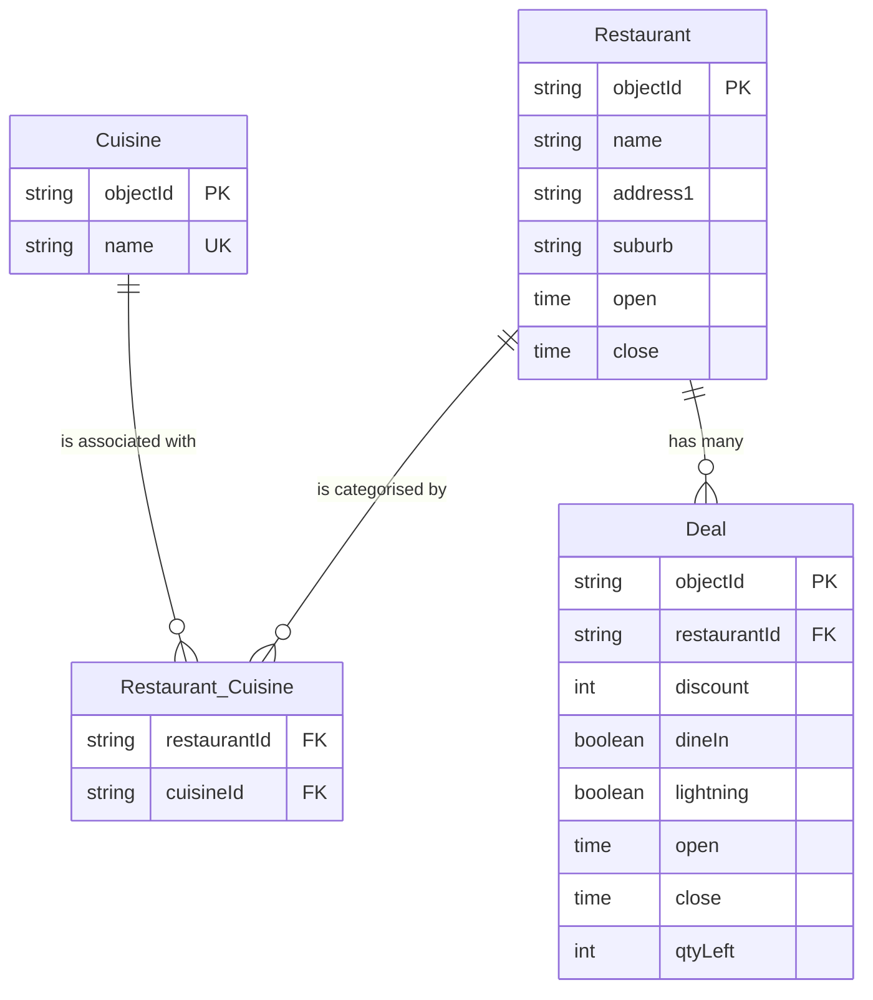

### EatClub Offers API

[](https://github.com/johnlayton/eatclub/actions/workflows/main.yml)

#### Run:

```shell

./mvnw spring-boot:run

```

#### Invoke:

```shell

curl http://localhost:8080/deals?time=11:00 | jq -r .

```
```shell

curl http://localhost:8080/deals?time=13:00 | jq -r .

```
```shell

curl http://localhost:8080/deals?time=17:00  | jq -r .

```

```shell

curl http://localhost:8080/deals?time=21:00  | jq -r .

```

```shell

curl http://localhost:8080/deals?time=23:30  | jq -r .

```

```shell

curl http://localhost:8080/peak  | jq -r .

```

#### Download Challenge Data:

```shell

wget https://eccdn.com.au/misc/challengedata.json --directory-prefix=src/test/resources

```

```shell

wget https://eccdn.com.au/misc/challengedata.json --directory-prefix=src/main/resources


```

#### Persistence



Whilst NoSQl databases are often used for such applications, this implementation would use the postgresql relational database for simplicity.
The data is loaded from the provided JSON file into the database at application startup (or periodically from the remote repository).

- Restaurant cuisine is effectively tagging information,
  tags can be added or removed from restaurants and filtering applied by cusine type,
  tags should be managed in a separate table allowing for deduplication
  so a many-to-many relationship is used between Restaurant and Cuisine.

- Deals are associated with a single restaurant,
  and have time windows when they are valid,
  as well as quantity available.
  Deals will have a foreign key relationship to Restaurant.

- Indexes would be created on frequently queried fields such as deal open/close times,
  restaurant open/close times, and cuisine names to optimize query performance.

Psudo Schema;
```sql
CREATE SCHEMA IF NOT EXISTS eatclub;

CREATE TABLE eatclub.restaurant (
    object_id varchar(36) PRIMARY KEY,
    name varchar(255) NOT NULL,
    address1 varchar(255),
    suburb varchar(255),
    open_time TIME NOT NULL,
    close_time TIME NOT NULL
);

CREATE TABLE eatclub.cuisine (
    object_id varchar(36) PRIMARY KEY,
    name varchar(255) NOT NULL UNIQUE
);

CREATE TABLE eatclub.deal (
    object_id varchar(36) PRIMARY KEY,
    restaurant_id varchar(36) NOT NULL REFERENCES eatclub.restaurant(object_id) ON DELETE CASCADE,
    discount INTEGER NOT NULL,
    dine_in BOOLEAN NOT NULL DEFAULT FALSE,
    lightning BOOLEAN NOT NULL DEFAULT FALSE,
    open_time TIME,
    close_time TIME,
    qty_left INTEGER
);

CREATE TABLE eatclub.restaurant_cuisine (
    restaurant_id varchar(36) NOT NULL REFERENCES eatclub.restaurant(object_id) ON DELETE CASCADE,
    cuisine_id varchar(36) NOT NULL REFERENCES eatclub.cuisine(object_id) ON DELETE CASCADE,
    PRIMARY KEY (restaurant_id, cuisine_id)
);

CREATE INDEX ON eatclub.deal (open_time);
CREATE INDEX ON eatclub.deal (close_time);
CREATE INDEX ON eatclub.restaurant (open_time);
CREATE INDEX ON eatclub.restaurant (close_time);
CREATE INDEX ON eatclub.cuisine (name);
```
```